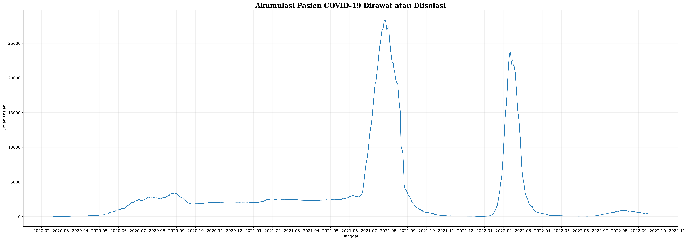
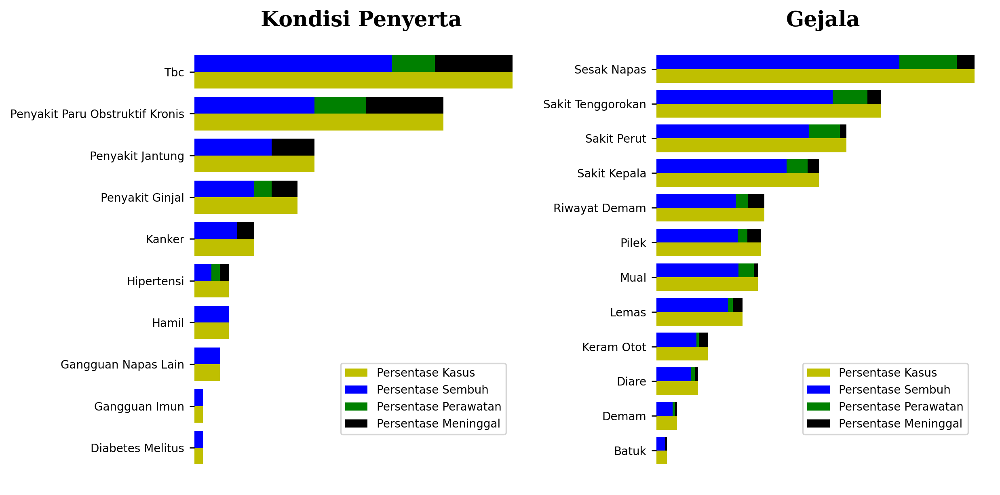
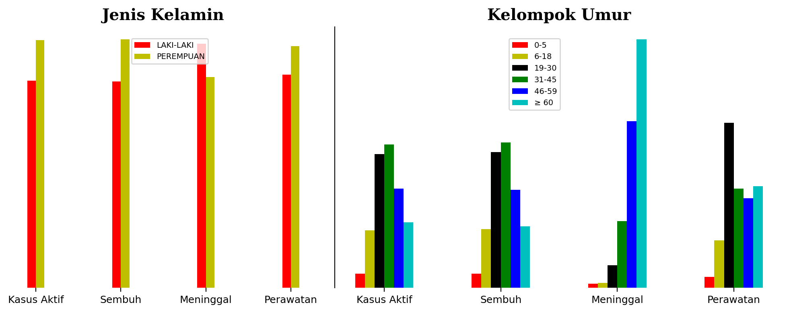

# COVID-19 di Provinsi Sumatera Utara, Indonesia

## Deskripsi Data

Dataset ini terdiri atas atribut berikut ini. <br>
* `last_date` : tanggal terakhir dataset diperbarui
* `provinsi` : provinsi dari dataset
* `kasus_total` : total kasus aktif COVID-19
* `kasus_tanpa_tgl` : total kasus aktif COVID-19 tanpa tanggal
* `kasus_dengan_tgl` : total kasus aktif COVID-19 dengan tanggal
* `meninggal_persen` : persentase kasus kematian COVID-19 terhadap total kasus
* `meninggal_tanpa_tgl` : jumlah kasus kematian COVID-19 tanpa tanggal
* `meninggal_dengan_tgl` : jumlah kasus kematian COVID-19 dengan tanggal
* `sembuh_persen` : persentase kasus sembuh COVID-19 terhadap total kasus
* `sembuh_tanpa_tgl` : jumlah kasus sembuh COVID-19 tanpa tanggal
* `sembuh_dengan_tgl` : jumlah kasus sembuh COVID-19 dengan tanggal
* `list_perkembangan` : dataframe berisi perkembangan COVID-19 per hari
* `data` : dictionary berisi data keseluruhan COVID-19 terhadap kondisi penyerta, jenis kelamin, kelompok umur, dan gejala <br>

Atribut `list_perkembangan` dan `data` merupakan fokus analisis Saya.

## Import Dataset


```python
import requests
import numpy as np
import pandas as pd
from datetime import datetime
import matplotlib.pyplot as plt
from scipy.signal import argrelextrema
import matplotlib.font_manager
import matplotlib.dates as mdates
import seaborn as sns
```


```python
resp2 = requests.get('https://data.covid19.go.id/public/api/prov_detail_SUMATERA_UTARA.json', verify=False)
print("Status keberhasilan", resp2)
```

    C:\ProgramData\Anaconda3\lib\site-packages\urllib3\connectionpool.py:1045: InsecureRequestWarning: Unverified HTTPS request is being made to host 'data.covid19.go.id'. Adding certificate verification is strongly advised. See: https://urllib3.readthedocs.io/en/1.26.x/advanced-usage.html#ssl-warnings
      warnings.warn(
    

    Status keberhasilan <Response [200]>
    


```python
update2 = resp2.json()
```

## Pratinjau atribut list_perkembangan


```python
update2['list_perkembangan'][:2]
```


    [{'tanggal': 1584403200000,
      'KASUS': 1,
      'MENINGGAL': 1,
      'SEMBUH': 0,
      'DIRAWAT_OR_ISOLASI': 0,
      'AKUMULASI_KASUS': 1,
      'AKUMULASI_SEMBUH': 0,
      'AKUMULASI_MENINGGAL': 1,
      'AKUMULASI_DIRAWAT_OR_ISOLASI': 0},
     {'tanggal': 1584489600000,
      'KASUS': 0,
      'MENINGGAL': 0,
      'SEMBUH': 0,
      'DIRAWAT_OR_ISOLASI': 0,
      'AKUMULASI_KASUS': 1,
      'AKUMULASI_SEMBUH': 0,
      'AKUMULASI_MENINGGAL': 1,
      'AKUMULASI_DIRAWAT_OR_ISOLASI': 0}]


## Preprocessing atribut list_perkembangan

Pertama, dictionary `update2['list_perkembangan']` akan diubah menjadi dataframe bernama `df_list_kmbg`. Lalu, atribut tanggal akan diubah dari tipe timestamp menjadi tipe datetime date.


```python
df_list_kmbg = pd.DataFrame(update2['list_perkembangan'])
df_list_kmbg['tanggal'] = [datetime.fromtimestamp(d/1e3).date() for d in df_list_kmbg['tanggal']]
```


```python
df_list_kmbg
```


<div>
<table border="1" class="dataframe">
  <thead>
    <tr style="text-align: right;">
      <th></th>
      <th>tanggal</th>
      <th>KASUS</th>
      <th>MENINGGAL</th>
      <th>SEMBUH</th>
      <th>DIRAWAT_OR_ISOLASI</th>
      <th>AKUMULASI_KASUS</th>
      <th>AKUMULASI_SEMBUH</th>
      <th>AKUMULASI_MENINGGAL</th>
      <th>AKUMULASI_DIRAWAT_OR_ISOLASI</th>
    </tr>
  </thead>
  <tbody>
    <tr>
      <th>0</th>
      <td>2020-03-17</td>
      <td>1</td>
      <td>1</td>
      <td>0</td>
      <td>0</td>
      <td>1</td>
      <td>0</td>
      <td>1</td>
      <td>0</td>
    </tr>
    <tr>
      <th>1</th>
      <td>2020-03-18</td>
      <td>0</td>
      <td>0</td>
      <td>0</td>
      <td>0</td>
      <td>1</td>
      <td>0</td>
      <td>1</td>
      <td>0</td>
    </tr>
    <tr>
      <th>2</th>
      <td>2020-03-19</td>
      <td>0</td>
      <td>0</td>
      <td>0</td>
      <td>0</td>
      <td>1</td>
      <td>0</td>
      <td>1</td>
      <td>0</td>
    </tr>
    <tr>
      <th>3</th>
      <td>2020-03-20</td>
      <td>0</td>
      <td>0</td>
      <td>0</td>
      <td>0</td>
      <td>1</td>
      <td>0</td>
      <td>1</td>
      <td>0</td>
    </tr>
    <tr>
      <th>4</th>
      <td>2020-03-21</td>
      <td>0</td>
      <td>0</td>
      <td>0</td>
      <td>0</td>
      <td>1</td>
      <td>0</td>
      <td>1</td>
      <td>0</td>
    </tr>
    <tr>
      <th>...</th>
      <td>...</td>
      <td>...</td>
      <td>...</td>
      <td>...</td>
      <td>...</td>
      <td>...</td>
      <td>...</td>
      <td>...</td>
      <td>...</td>
    </tr>
    <tr>
      <th>923</th>
      <td>2022-09-26</td>
      <td>16</td>
      <td>1</td>
      <td>55</td>
      <td>-40</td>
      <td>159349</td>
      <td>155670</td>
      <td>3295</td>
      <td>384</td>
    </tr>
    <tr>
      <th>924</th>
      <td>2022-09-27</td>
      <td>14</td>
      <td>1</td>
      <td>7</td>
      <td>6</td>
      <td>159363</td>
      <td>155677</td>
      <td>3296</td>
      <td>390</td>
    </tr>
    <tr>
      <th>925</th>
      <td>2022-09-28</td>
      <td>31</td>
      <td>0</td>
      <td>2</td>
      <td>29</td>
      <td>159394</td>
      <td>155679</td>
      <td>3296</td>
      <td>419</td>
    </tr>
    <tr>
      <th>926</th>
      <td>2022-09-29</td>
      <td>5</td>
      <td>0</td>
      <td>5</td>
      <td>0</td>
      <td>159399</td>
      <td>155684</td>
      <td>3296</td>
      <td>419</td>
    </tr>
    <tr>
      <th>927</th>
      <td>2022-09-30</td>
      <td>34</td>
      <td>0</td>
      <td>10</td>
      <td>24</td>
      <td>159433</td>
      <td>155694</td>
      <td>3296</td>
      <td>443</td>
    </tr>
  </tbody>
</table>
<p>928 rows × 9 columns</p>
</div>


Saya tidak tertarik pada atribut `AKUMULASI_KASUS`, `AKUMULASI_SEMBUH`, dan `AKUMULASI_MENINGGAL`, karena nilai-nilai tersebut hanya nilai kumulatif, yaitu tidak menunjukkan nilai aslinya secara langsung. Khusus untuk `DIRAWAT_OR_ISOLASI`, Saya memilih `AKUMULASI_DIRAWAT_OR_ISOLASI` karena memuat nilai negatif yang menyatakan pasien dirawat atau diisolasi sembuh atau meninggal. Untuk itu, Saya berfokus pada 4 kolom pertama dan satu kolom terakhir, lalu mengecek apakah ada nilai kosong.


```python
df_list_kmbg_bulan = df_list_kmbg.iloc[:,:4].copy()
df_list_kmbg_bulan = df_list_kmbg_bulan.join(df_list_kmbg.iloc[:,-1])
df_list_kmbg_bulan.isnull().sum()
```


    tanggal                         0
    KASUS                           0
    MENINGGAL                       0
    SEMBUH                          0
    AKUMULASI_DIRAWAT_OR_ISOLASI    0
    dtype: int64


Lalu, Saya memecah `tanggal` bertipe datetime date menjadi `tahun`, `bulan`, dan `hari` masing-masing berjenis string. Hal ini Saya lakukan agar dapat fokus pada tahun dan bulan atau hari di bulan tertentu.


```python
df_list_kmbg_bulan['tahun'] = [d.year for d in df_list_kmbg_bulan['tanggal']]
df_list_kmbg_bulan['bulan'] = [d.month for d in df_list_kmbg_bulan['tanggal']]
df_list_kmbg_bulan['hari'] = [d.day for d in df_list_kmbg_bulan['tanggal']]
```


```python
df_list_kmbg_bulan
```


<div>
<style scoped>
    .dataframe tbody tr th:only-of-type {
        vertical-align: middle;
    }

    .dataframe tbody tr th {
        vertical-align: top;
    }

    .dataframe thead th {
        text-align: right;
    }
</style>
<table border="1" class="dataframe">
  <thead>
    <tr style="text-align: right;">
      <th></th>
      <th>tanggal</th>
      <th>KASUS</th>
      <th>MENINGGAL</th>
      <th>SEMBUH</th>
      <th>AKUMULASI_DIRAWAT_OR_ISOLASI</th>
      <th>tahun</th>
      <th>bulan</th>
      <th>hari</th>
    </tr>
  </thead>
  <tbody>
    <tr>
      <th>0</th>
      <td>2020-03-17</td>
      <td>1</td>
      <td>1</td>
      <td>0</td>
      <td>0</td>
      <td>2020</td>
      <td>3</td>
      <td>17</td>
    </tr>
    <tr>
      <th>1</th>
      <td>2020-03-18</td>
      <td>0</td>
      <td>0</td>
      <td>0</td>
      <td>0</td>
      <td>2020</td>
      <td>3</td>
      <td>18</td>
    </tr>
    <tr>
      <th>2</th>
      <td>2020-03-19</td>
      <td>0</td>
      <td>0</td>
      <td>0</td>
      <td>0</td>
      <td>2020</td>
      <td>3</td>
      <td>19</td>
    </tr>
    <tr>
      <th>3</th>
      <td>2020-03-20</td>
      <td>0</td>
      <td>0</td>
      <td>0</td>
      <td>0</td>
      <td>2020</td>
      <td>3</td>
      <td>20</td>
    </tr>
    <tr>
      <th>4</th>
      <td>2020-03-21</td>
      <td>0</td>
      <td>0</td>
      <td>0</td>
      <td>0</td>
      <td>2020</td>
      <td>3</td>
      <td>21</td>
    </tr>
    <tr>
      <th>...</th>
      <td>...</td>
      <td>...</td>
      <td>...</td>
      <td>...</td>
      <td>...</td>
      <td>...</td>
      <td>...</td>
      <td>...</td>
    </tr>
    <tr>
      <th>923</th>
      <td>2022-09-26</td>
      <td>16</td>
      <td>1</td>
      <td>55</td>
      <td>384</td>
      <td>2022</td>
      <td>9</td>
      <td>26</td>
    </tr>
    <tr>
      <th>924</th>
      <td>2022-09-27</td>
      <td>14</td>
      <td>1</td>
      <td>7</td>
      <td>390</td>
      <td>2022</td>
      <td>9</td>
      <td>27</td>
    </tr>
    <tr>
      <th>925</th>
      <td>2022-09-28</td>
      <td>31</td>
      <td>0</td>
      <td>2</td>
      <td>419</td>
      <td>2022</td>
      <td>9</td>
      <td>28</td>
    </tr>
    <tr>
      <th>926</th>
      <td>2022-09-29</td>
      <td>5</td>
      <td>0</td>
      <td>5</td>
      <td>419</td>
      <td>2022</td>
      <td>9</td>
      <td>29</td>
    </tr>
    <tr>
      <th>927</th>
      <td>2022-09-30</td>
      <td>34</td>
      <td>0</td>
      <td>10</td>
      <td>443</td>
      <td>2022</td>
      <td>9</td>
      <td>30</td>
    </tr>
  </tbody>
</table>
<p>928 rows × 8 columns</p>
</div>


Kemudian, Saya melakukan penjumlahan kasus aktif, kematian, dan sembuh dari COVID-19 terhadap tahun dan bulan.


```python
df_kmbg_tahun_bulan = df_list_kmbg_bulan.groupby(['tahun','bulan'])['KASUS','MENINGGAL','SEMBUH'].sum()
```

    C:\Users\ofiei\AppData\Local\Temp\ipykernel_4716\1183139619.py:1: FutureWarning: Indexing with multiple keys (implicitly converted to a tuple of keys) will be deprecated, use a list instead.
      df_kmbg_tahun_bulan = df_list_kmbg_bulan.groupby(['tahun','bulan'])['KASUS','MENINGGAL','SEMBUH'].sum()
    


```python
colors = list("rgbk")
fig, axs = plt.subplots(ncols=2, nrows=2, figsize=(10,5), dpi=200)
ax1 = axs[0,0]
ax2 = axs[1,0]
ax3 = axs[0,1]
ax4 = axs[1,1]
ax4.remove()

for thun in [2020, 2021, 2022]:
    bulan = np.array([l[1] for l in df_kmbg_tahun_bulan.index if l[0] == thun])
    data_bulan_kasus = df_kmbg_tahun_bulan.loc[(thun,),'KASUS']
    data_bulan_meninggal = df_kmbg_tahun_bulan.loc[(thun,),'MENINGGAL']
    data_bulan_sembuh = df_kmbg_tahun_bulan.loc[(thun,),'SEMBUH']
    
    x_puncak_lokal_kasus = argrelextrema(np.array(data_bulan_kasus), np.greater)
    for x in x_puncak_lokal_kasus[0]:
        ax1.vlines(data_bulan_kasus.index[x], ymin=0, ymax=data_bulan_kasus.iloc[x],
                  linestyles='dashed', alpha=0.4, color = colors[-1])
        
    x_puncak_lokal_meninggal = argrelextrema(np.array(data_bulan_meninggal), np.greater)
    for x in x_puncak_lokal_meninggal[0]:
        ax2.vlines(data_bulan_meninggal.index[x], ymin=0, ymax=data_bulan_meninggal.iloc[x],
                  linestyles='dashed', alpha=0.4, color = colors[-1])
        
    x_puncak_lokal_sembuh = argrelextrema(np.array(data_bulan_sembuh), np.greater)
    for x in x_puncak_lokal_sembuh[0]:
        ax3.vlines(data_bulan_sembuh.index[x], ymin=0, ymax=data_bulan_sembuh.iloc[x],
                  linestyles='dashed', alpha=0.4, color = colors[-1])
    
    ax1.plot(bulan, data_bulan_kasus, label=f"Tahun {thun}", color = colors[-1], marker='.')
    ax2.plot(bulan, data_bulan_meninggal, label=f"Tahun {thun}", color = colors[-1], marker='.')
    ax3.plot(bulan, data_bulan_sembuh, label=f"Tahun {thun}", color = colors.pop(), marker='.')

plt.suptitle("COVID-19 di Provinsi Sumatera Utara", fontfamily='serif', fontsize=15, fontweight='bold')

ax1.set_xticks(range(1,13))
ax1.spines[['top', 'right']].set_visible(False)
ax1.tick_params(axis='both', which='major', labelsize=7)
ax1.set_ylabel("Jumlah Kasus Aktif")
ax1.grid(True, axis='y', alpha=0.2)
ax1.legend(loc = 'upper right', bbox_to_anchor=(0.5,0.9), prop={'size':7})

ax2.set_xticks(range(1,13))
ax2.spines[['top', 'right']].set_visible(False)
ax2.tick_params(axis='both', which='major', labelsize=7)
ax2.set_xlabel("Bulan")
ax2.set_ylabel("Jumlah Kasus Meninggal")
ax2.grid(True, axis='y', alpha=0.2)
ax2.legend(loc = 'upper right', bbox_to_anchor=(0.4,0.9), prop={'size':7})

ax3.set_xticks(range(1,13))
ax3.spines[['top', 'right']].set_visible(False)
ax3.tick_params(axis='both', which='major', labelsize=7)
ax3.set_ylabel("Jumlah Kasus Sembuh")
ax3.set_xlabel("Bulan")
ax3.grid(True, axis='y', alpha=0.2)
ax3.legend(loc = 'upper right', bbox_to_anchor=(0.5,0.95), prop={'size':7})

plt.tight_layout()
plt.show()
```


    

    


Berdasarkan visualisasi data, pada tahun 2020, jumlah kasus aktif COVID-19 memuncak di bulan 9 dan diikuti jumlah kasus sembuh memuncak di bulan 10. Sebelum itu, jumlah kasus meninggal memuncak di bulan 8. <br><br>
Jumlah kasus meninggal terbesar terjadi di bulan 8 tahun 2021. Di bulan dan tahun yang sama, jumlah kasus aktif dan kasus sembuh juga memuncak. Hal ini menunjukkan bahwa, bulan 8 tahun 2021 merupakan tekanan terbesar dari COVID-19 terhadap warga provinsi Sumatera Utara. <br><br>
Pada tahun berikutnya, tahun 2022, terjadi peningkatan kasus aktif terbesar dari bulan 1 ke bulan 2. Pada bulan yang sama, juga terjadi peningkatan terhadap jumlah kasus sembuh dan meninggal. Tetapi, puncak dari kasus sembuh dan meninggal, terjadi satu bulan setelahnya, yaitu bulan 3. <br><br>
Dengan kata lain, berdasarkan visualisasi data, kasus COVID-19 memuncak di bulan 1 hingga bulan 4 dan di bulan 6 hingga bulan 10.


```python
df_list_kmbg_bulan['tanggal']
```


    0      2020-03-17
    1      2020-03-18
    2      2020-03-19
    3      2020-03-20
    4      2020-03-21
              ...    
    923    2022-09-26
    924    2022-09-27
    925    2022-09-28
    926    2022-09-29
    927    2022-09-30
    Name: tanggal, Length: 928, dtype: object


```python
fig, ax = plt.subplots(figsize=(30,10), dpi=300)
ax.plot(df_list_kmbg_bulan['tanggal'], df_list_kmbg_bulan['AKUMULASI_DIRAWAT_OR_ISOLASI'])
ax.xaxis.set_major_locator(mdates.DayLocator(interval=30))
ax.xaxis.set_major_formatter(mdates.DateFormatter('%Y-%m'))
ax.grid(axis='both', alpha=0.2)
ax.set_title('Akumulasi Pasien COVID-19 Dirawat atau Diisolasi',fontfamily='serif',fontsize=17,fontweight='bold')
ax.set_xlabel('Tanggal')
ax.set_ylabel('Jumlah Pasien')
plt.show()
```


    

    


Sebagai akibat dari peningkatan jumlah kasus aktif COVID-19, jumlah pasien yang dirawat atau diisolasi juga meningkat. Bersesuaian dengan kasus aktif, peningkatan pasien dirawat atau diisolasi terjadi di bulan 6 sampai bulan 9 tahun 2020, bulan 6 sampai bulan 8 tahun 2021, dan bulan 1 sampai bulan 3 tahun 2022.

## Pratinjau atribut data


```python
update2['data']
```


    {'last_update': '2022-09-30',
     'kasus': {'kondisi_penyerta': {'current_data': 93,
       'missing_data': 99.94166828699203,
       'list_data': [{'key': 'HIPERTENSI', 'doc_count': 39.784946236559136},
        {'key': 'DIABETES MELITUS', 'doc_count': 31.182795698924732},
        {'key': 'PENYAKIT JANTUNG', 'doc_count': 15.053763440860216},
        {'key': 'PENYAKIT PARU OBSTRUKTIF KRONIS',
         'doc_count': 12.903225806451612},
        {'key': 'PENYAKIT GINJAL', 'doc_count': 7.526881720430108},
        {'key': 'GANGGUAN IMUN', 'doc_count': 4.301075268817205},
        {'key': 'KANKER', 'doc_count': 4.301075268817205},
        {'key': 'HAMIL', 'doc_count': 3.225806451612903},
        {'key': 'GANGGUAN NAPAS LAIN', 'doc_count': 1.0752688172043012},
        {'key': 'TBC', 'doc_count': 1.0752688172043012}]},
      'jenis_kelamin': {'current_data': 159121,
       'missing_data': 0.1956934888009414,
       'list_data': [{'key': 'LAKI-LAKI', 'doc_count': 45.50436460303794},
        {'key': 'PEREMPUAN', 'doc_count': 54.49563539696206}]},
      'kelompok_umur': {'current_data': 158939,
       'missing_data': 0.30984802393481914,
       'list_data': [{'key': '0-5',
         'doc_count': 2.679644391873612,
         'usia': {'value': 5.0}},
        {'key': '6-18', 'doc_count': 11.198635954674435, 'usia': {'value': 18.0}},
        {'key': '19-30', 'doc_count': 26.050245691743374, 'usia': {'value': 30.0}},
        {'key': '31-45', 'doc_count': 27.988096062011213, 'usia': {'value': 45.0}},
        {'key': '46-59', 'doc_count': 19.355224331347245, 'usia': {'value': 59.0}},
        {'key': '≥ 60',
         'doc_count': 12.728153568350123,
         'usia': {'value': 2022.0}}]},
      'gejala': {'current_data': 684,
       'missing_data': 99.57097965916718,
       'list_data': [{'key': 'BATUK', 'doc_count': 57.748538011695906},
        {'key': 'RIWAYAT DEMAM', 'doc_count': 40.78947368421053},
        {'key': 'PILEK', 'doc_count': 34.50292397660819},
        {'key': 'DEMAM', 'doc_count': 29.53216374269006},
        {'key': 'SESAK NAPAS', 'doc_count': 19.5906432748538},
        {'key': 'LEMAS', 'doc_count': 19.005847953216374},
        {'key': 'SAKIT TENGGOROKAN', 'doc_count': 18.421052631578945},
        {'key': 'SAKIT KEPALA', 'doc_count': 15.64327485380117},
        {'key': 'KERAM OTOT', 'doc_count': 9.35672514619883},
        {'key': 'MUAL', 'doc_count': 7.602339181286549},
        {'key': 'SAKIT PERUT', 'doc_count': 3.8011695906432745},
        {'key': 'DIARE', 'doc_count': 1.9005847953216373}]}},
     'sembuh': {'kondisi_penyerta': {'list_data': [{'key': 'HIPERTENSI',
         'doc_count': 24.731182795698924},
        {'key': 'DIABETES MELITUS', 'doc_count': 15.053763440860216},
        {'key': 'PENYAKIT JANTUNG', 'doc_count': 9.67741935483871},
        {'key': 'PENYAKIT PARU OBSTRUKTIF KRONIS', 'doc_count': 7.526881720430108},
        {'key': 'PENYAKIT GINJAL', 'doc_count': 5.376344086021505},
        {'key': 'GANGGUAN IMUN', 'doc_count': 4.301075268817205},
        {'key': 'HAMIL', 'doc_count': 3.225806451612903},
        {'key': 'KANKER', 'doc_count': 2.1505376344086025},
        {'key': 'GANGGUAN NAPAS LAIN', 'doc_count': 1.0752688172043012},
        {'key': 'TBC', 'doc_count': 1.0752688172043012}]},
      'jenis_kelamin': {'list_data': [{'key': 'LAKI-LAKI',
         'doc_count': 45.328888946088206},
        {'key': 'PEREMPUAN', 'doc_count': 54.671111053911794}]},
      'kelompok_umur': {'list_data': [{'key': '0-5',
         'doc_count': 2.7225522155364574,
         'usia': {'value': 5.0}},
        {'key': '6-18', 'doc_count': 11.42106144747523, 'usia': {'value': 18.0}},
        {'key': '19-30', 'doc_count': 26.492378657664506, 'usia': {'value': 30.0}},
        {'key': '31-45', 'doc_count': 28.330391310510105, 'usia': {'value': 45.0}},
        {'key': '46-59', 'doc_count': 19.0823465745835, 'usia': {'value': 59.0}},
        {'key': '≥ 60',
         'doc_count': 11.951269794230198,
         'usia': {'value': 2022.0}}]},
      'gejala': {'list_data': [{'key': 'BATUK', 'doc_count': 44.15204678362573},
        {'key': 'RIWAYAT DEMAM', 'doc_count': 32.01754385964912},
        {'key': 'PILEK', 'doc_count': 27.77777777777778},
        {'key': 'DEMAM', 'doc_count': 23.684210526315788},
        {'key': 'SAKIT TENGGOROKAN', 'doc_count': 14.912280701754385},
        {'key': 'LEMAS', 'doc_count': 14.76608187134503},
        {'key': 'SESAK NAPAS', 'doc_count': 14.473684210526317},
        {'key': 'SAKIT KEPALA', 'doc_count': 13.011695906432749},
        {'key': 'KERAM OTOT', 'doc_count': 7.309941520467836},
        {'key': 'MUAL', 'doc_count': 6.286549707602338},
        {'key': 'SAKIT PERUT', 'doc_count': 2.923976608187134},
        {'key': 'DIARE', 'doc_count': 1.608187134502924}]}},
     'meninggal': {'kondisi_penyerta': {'list_data': [{'key': 'DIABETES MELITUS',
         'doc_count': 9.67741935483871},
        {'key': 'HIPERTENSI', 'doc_count': 9.67741935483871},
        {'key': 'PENYAKIT JANTUNG', 'doc_count': 5.376344086021505},
        {'key': 'PENYAKIT PARU OBSTRUKTIF KRONIS', 'doc_count': 3.225806451612903},
        {'key': 'PENYAKIT GINJAL', 'doc_count': 2.1505376344086025},
        {'key': 'KANKER', 'doc_count': 1.0752688172043012}]},
      'jenis_kelamin': {'list_data': [{'key': 'LAKI-LAKI',
         'doc_count': 53.62362971985384},
        {'key': 'PEREMPUAN', 'doc_count': 46.37637028014616}]},
      'kelompok_umur': {'list_data': [{'key': '0-5',
         'doc_count': 0.7312614259597806,
         'usia': {'value': 4.0}},
        {'key': '6-18', 'doc_count': 0.9445460085313834, 'usia': {'value': 18.0}},
        {'key': '19-30', 'doc_count': 4.3266301035953685, 'usia': {'value': 30.0}},
        {'key': '31-45', 'doc_count': 12.949421084704449, 'usia': {'value': 45.0}},
        {'key': '46-59', 'doc_count': 32.51066422912858, 'usia': {'value': 59.0}},
        {'key': '≥ 60', 'doc_count': 48.53747714808044, 'usia': {'value': 97.0}}]},
      'gejala': {'list_data': [{'key': 'BATUK', 'doc_count': 3.216374269005848},
        {'key': 'SESAK NAPAS', 'doc_count': 2.923976608187134},
        {'key': 'LEMAS', 'doc_count': 2.4853801169590644},
        {'key': 'RIWAYAT DEMAM', 'doc_count': 2.4853801169590644},
        {'key': 'DEMAM', 'doc_count': 2.046783625730994},
        {'key': 'SAKIT KEPALA', 'doc_count': 1.7543859649122806},
        {'key': 'KERAM OTOT', 'doc_count': 1.608187134502924},
        {'key': 'PILEK', 'doc_count': 1.1695906432748537},
        {'key': 'SAKIT TENGGOROKAN', 'doc_count': 0.7309941520467835},
        {'key': 'MUAL', 'doc_count': 0.5847953216374269},
        {'key': 'SAKIT PERUT', 'doc_count': 0.43859649122807015},
        {'key': 'DIARE', 'doc_count': 0.29239766081871343}]}},
     'perawatan': {'kondisi_penyerta': {'list_data': [{'key': 'DIABETES MELITUS',
         'doc_count': 6.451612903225806},
        {'key': 'HIPERTENSI', 'doc_count': 5.376344086021505},
        {'key': 'PENYAKIT PARU OBSTRUKTIF KRONIS',
         'doc_count': 2.1505376344086025},
        {'key': 'KANKER', 'doc_count': 1.0752688172043012}]},
      'jenis_kelamin': {'list_data': [{'key': 'LAKI-LAKI',
         'doc_count': 46.89655172413793},
        {'key': 'PEREMPUAN', 'doc_count': 53.103448275862064}]},
      'kelompok_umur': {'list_data': [{'key': '0-5',
         'doc_count': 2.0689655172413794,
         'usia': {'value': 3.0}},
        {'key': '6-18', 'doc_count': 9.195402298850574, 'usia': {'value': 18.0}},
        {'key': '19-30', 'doc_count': 32.18390804597701, 'usia': {'value': 30.0}},
        {'key': '31-45', 'doc_count': 19.310344827586206, 'usia': {'value': 45.0}},
        {'key': '46-59', 'doc_count': 17.47126436781609, 'usia': {'value': 59.0}},
        {'key': '≥ 60',
         'doc_count': 19.770114942528735,
         'usia': {'value': 94.0}}]},
      'gejala': {'list_data': [{'key': 'BATUK', 'doc_count': 10.380116959064328},
        {'key': 'RIWAYAT DEMAM', 'doc_count': 6.286549707602338},
        {'key': 'PILEK', 'doc_count': 5.555555555555555},
        {'key': 'DEMAM', 'doc_count': 3.8011695906432745},
        {'key': 'SAKIT TENGGOROKAN', 'doc_count': 2.7777777777777777},
        {'key': 'SESAK NAPAS', 'doc_count': 2.1929824561403506},
        {'key': 'LEMAS', 'doc_count': 1.7543859649122806},
        {'key': 'SAKIT KEPALA', 'doc_count': 0.8771929824561403},
        {'key': 'MUAL', 'doc_count': 0.7309941520467835},
        {'key': 'KERAM OTOT', 'doc_count': 0.43859649122807015},
        {'key': 'SAKIT PERUT', 'doc_count': 0.43859649122807015}]}}}


```python
update2['data'].keys()
```


    dict_keys(['last_update', 'kasus', 'sembuh', 'meninggal', 'perawatan'])


```python
for k in ['kasus', 'sembuh', 'meninggal', 'perawatan']:
    print(update2['data'][k].keys())
```

    dict_keys(['kondisi_penyerta', 'jenis_kelamin', 'kelompok_umur', 'gejala'])
    dict_keys(['kondisi_penyerta', 'jenis_kelamin', 'kelompok_umur', 'gejala'])
    dict_keys(['kondisi_penyerta', 'jenis_kelamin', 'kelompok_umur', 'gejala'])
    dict_keys(['kondisi_penyerta', 'jenis_kelamin', 'kelompok_umur', 'gejala'])
    

Atribut `data` terdiri atas kasus aktif, sembuh, meninggal, dan perawatan COVID-19 yang masing-masing memiliki atribut `kondisi_penyerta`, `jenis_kelamin`, `kelompok_umur`, dan `gejala`.


```python
print('Kasus Aktif COVID-19:')
for k2 in update2['data']['kasus'].keys():
    print('Berdasarkan', k2)
    print('      Jumlah data yang tidak kosong:',update2['data']['kasus'][k2]['current_data'])
    print('      Persentase data kosong terhadap total data:',update2['data']['kasus'][k2]['missing_data'])
    print()
```

    Kasus Aktif COVID-19:
    Berdasarkan kondisi_penyerta
          Jumlah data yang tidak kosong: 93
          Persentase data kosong terhadap total data: 99.94166828699203
    
    Berdasarkan jenis_kelamin
          Jumlah data yang tidak kosong: 159121
          Persentase data kosong terhadap total data: 0.1956934888009414
    
    Berdasarkan kelompok_umur
          Jumlah data yang tidak kosong: 158939
          Persentase data kosong terhadap total data: 0.30984802393481914
    
    Berdasarkan gejala
          Jumlah data yang tidak kosong: 684
          Persentase data kosong terhadap total data: 99.57097965916718
    
    

Meskipun persentase data kosong dari `kondisi_penyerta` dan `gejala` di atas 99%, data tersebut tetap akan Saya analisis, karena nilai dari data (`doc_count` di `list_data`) merupakan persentase. Dengan kata lain, Saya akan melihat perbandingan antara kategori di `kondisi_penyerta` dan `gejala`.

## Preprocessing atribut data

Pertama, Saya mengubah dictionary atribut `data` menjadi suatu dataframe dengan kunci ganda (*multi-key*).


```python
kond_peny_dict = {}
jen_kel_dict = {}
kel_umur_dict = {}
gejala_dict = {}
for y in ['kasus', 'sembuh', 'meninggal', 'perawatan']:
    kond_peny_key = [ x['key'] for x in update2['data'][y]['kondisi_penyerta']['list_data'] ]
    kond_peny_val = [ x['doc_count'] for x in update2['data'][y]['kondisi_penyerta']['list_data'] ]
    kond_peny_dict[y] = pd.Series(kond_peny_val, index=kond_peny_key)
    
    jen_kel_key = [ x['key'] for x in update2['data'][y]['jenis_kelamin']['list_data'] ]
    jen_kel_val = [ x['doc_count'] for x in update2['data'][y]['jenis_kelamin']['list_data'] ]
    jen_kel_dict[y] = pd.Series(jen_kel_val, index=jen_kel_key)
    
    kel_umur_key = [ x['key'] for x in update2['data'][y]['kelompok_umur']['list_data'] ]
    kel_umur_val = [ x['doc_count'] for x in update2['data'][y]['kelompok_umur']['list_data'] ]
    kel_umur_dict[y] = pd.Series(kel_umur_val, index=kel_umur_key)
    
    gejala_key = [ x['key'] for x in update2['data'][y]['gejala']['list_data'] ]
    gejala_val = [ x['doc_count'] for x in update2['data'][y]['gejala']['list_data'] ]
    gejala_dict[y] = pd.Series(gejala_val, index=gejala_key)
    
df_kond_peny = pd.DataFrame(data=kond_peny_dict)
df_jen_kel = pd.DataFrame(data=jen_kel_dict)
df_kel_umur = pd.DataFrame(data=kel_umur_dict)   
df_gejala = pd.DataFrame(data=gejala_dict)

df_gabung = pd.concat([df_kond_peny, df_jen_kel, df_kel_umur, df_gejala], keys=['kondisi_penyerta', 'jenis_kelamin', 'kelompok_umur', 'gejala'])

```


```python
df_gabung
```


<div>
<style scoped>
    .dataframe tbody tr th:only-of-type {
        vertical-align: middle;
    }

    .dataframe tbody tr th {
        vertical-align: top;
    }

    .dataframe thead th {
        text-align: right;
    }
</style>
<table border="1" class="dataframe">
  <thead>
    <tr style="text-align: right;">
      <th></th>
      <th></th>
      <th>kasus</th>
      <th>sembuh</th>
      <th>meninggal</th>
      <th>perawatan</th>
    </tr>
  </thead>
  <tbody>
    <tr>
      <th rowspan="10" valign="top">kondisi_penyerta</th>
      <th>DIABETES MELITUS</th>
      <td>31.182796</td>
      <td>15.053763</td>
      <td>9.677419</td>
      <td>6.451613</td>
    </tr>
    <tr>
      <th>GANGGUAN IMUN</th>
      <td>4.301075</td>
      <td>4.301075</td>
      <td>NaN</td>
      <td>NaN</td>
    </tr>
    <tr>
      <th>GANGGUAN NAPAS LAIN</th>
      <td>1.075269</td>
      <td>1.075269</td>
      <td>NaN</td>
      <td>NaN</td>
    </tr>
    <tr>
      <th>HAMIL</th>
      <td>3.225806</td>
      <td>3.225806</td>
      <td>NaN</td>
      <td>NaN</td>
    </tr>
    <tr>
      <th>HIPERTENSI</th>
      <td>39.784946</td>
      <td>24.731183</td>
      <td>9.677419</td>
      <td>5.376344</td>
    </tr>
    <tr>
      <th>KANKER</th>
      <td>4.301075</td>
      <td>2.150538</td>
      <td>1.075269</td>
      <td>1.075269</td>
    </tr>
    <tr>
      <th>PENYAKIT GINJAL</th>
      <td>7.526882</td>
      <td>5.376344</td>
      <td>2.150538</td>
      <td>NaN</td>
    </tr>
    <tr>
      <th>PENYAKIT JANTUNG</th>
      <td>15.053763</td>
      <td>9.677419</td>
      <td>5.376344</td>
      <td>NaN</td>
    </tr>
    <tr>
      <th>PENYAKIT PARU OBSTRUKTIF KRONIS</th>
      <td>12.903226</td>
      <td>7.526882</td>
      <td>3.225806</td>
      <td>2.150538</td>
    </tr>
    <tr>
      <th>TBC</th>
      <td>1.075269</td>
      <td>1.075269</td>
      <td>NaN</td>
      <td>NaN</td>
    </tr>
    <tr>
      <th rowspan="2" valign="top">jenis_kelamin</th>
      <th>LAKI-LAKI</th>
      <td>45.504365</td>
      <td>45.328889</td>
      <td>53.623630</td>
      <td>46.896552</td>
    </tr>
    <tr>
      <th>PEREMPUAN</th>
      <td>54.495635</td>
      <td>54.671111</td>
      <td>46.376370</td>
      <td>53.103448</td>
    </tr>
    <tr>
      <th rowspan="6" valign="top">kelompok_umur</th>
      <th>0-5</th>
      <td>2.679644</td>
      <td>2.722552</td>
      <td>0.731261</td>
      <td>2.068966</td>
    </tr>
    <tr>
      <th>6-18</th>
      <td>11.198636</td>
      <td>11.421061</td>
      <td>0.944546</td>
      <td>9.195402</td>
    </tr>
    <tr>
      <th>19-30</th>
      <td>26.050246</td>
      <td>26.492379</td>
      <td>4.326630</td>
      <td>32.183908</td>
    </tr>
    <tr>
      <th>31-45</th>
      <td>27.988096</td>
      <td>28.330391</td>
      <td>12.949421</td>
      <td>19.310345</td>
    </tr>
    <tr>
      <th>46-59</th>
      <td>19.355224</td>
      <td>19.082347</td>
      <td>32.510664</td>
      <td>17.471264</td>
    </tr>
    <tr>
      <th>≥ 60</th>
      <td>12.728154</td>
      <td>11.951270</td>
      <td>48.537477</td>
      <td>19.770115</td>
    </tr>
    <tr>
      <th rowspan="12" valign="top">gejala</th>
      <th>BATUK</th>
      <td>57.748538</td>
      <td>44.152047</td>
      <td>3.216374</td>
      <td>10.380117</td>
    </tr>
    <tr>
      <th>DEMAM</th>
      <td>29.532164</td>
      <td>23.684211</td>
      <td>2.046784</td>
      <td>3.801170</td>
    </tr>
    <tr>
      <th>DIARE</th>
      <td>1.900585</td>
      <td>1.608187</td>
      <td>0.292398</td>
      <td>NaN</td>
    </tr>
    <tr>
      <th>KERAM OTOT</th>
      <td>9.356725</td>
      <td>7.309942</td>
      <td>1.608187</td>
      <td>0.438596</td>
    </tr>
    <tr>
      <th>LEMAS</th>
      <td>19.005848</td>
      <td>14.766082</td>
      <td>2.485380</td>
      <td>1.754386</td>
    </tr>
    <tr>
      <th>MUAL</th>
      <td>7.602339</td>
      <td>6.286550</td>
      <td>0.584795</td>
      <td>0.730994</td>
    </tr>
    <tr>
      <th>PILEK</th>
      <td>34.502924</td>
      <td>27.777778</td>
      <td>1.169591</td>
      <td>5.555556</td>
    </tr>
    <tr>
      <th>RIWAYAT DEMAM</th>
      <td>40.789474</td>
      <td>32.017544</td>
      <td>2.485380</td>
      <td>6.286550</td>
    </tr>
    <tr>
      <th>SAKIT KEPALA</th>
      <td>15.643275</td>
      <td>13.011696</td>
      <td>1.754386</td>
      <td>0.877193</td>
    </tr>
    <tr>
      <th>SAKIT PERUT</th>
      <td>3.801170</td>
      <td>2.923977</td>
      <td>0.438596</td>
      <td>0.438596</td>
    </tr>
    <tr>
      <th>SAKIT TENGGOROKAN</th>
      <td>18.421053</td>
      <td>14.912281</td>
      <td>0.730994</td>
      <td>2.777778</td>
    </tr>
    <tr>
      <th>SESAK NAPAS</th>
      <td>19.590643</td>
      <td>14.473684</td>
      <td>2.923977</td>
      <td>2.192982</td>
    </tr>
  </tbody>
</table>
</div>


```python
df_gabung['kasus']['kondisi_penyerta'].sum()
```


    120.43010752688173


```python
df_gabung['kasus']['gejala'].sum()
```


    257.89473684210526


Perhatikan bahwa jumlah persentase dari kasus aktif (`kasus`) terhadap `kondisi_penyerta` dan `gejala` tidak 100%. Hal ini disebabkan karena setiap pasien dapat memiliki lebih dari satu kondisi penyerta atau gejala.

Lalu, terdapat data kosong di `df_gabung`, yaitu dibagian `kondisi_penyerta` dan `gejala`. Perhatikan bahwa, untuk `kondisi_penyerta` dan `gejala`, `kasus` merupakan penjumlahan dari `sembuh`, `meninggal`, dan `perawatan`. Untuk itu, Saya akan mengubah data kosong menjadi nilai 0.


```python
df_gabung = df_gabung.fillna(0)
```

Berbeda dengan `kondisi_penyerta` dan `gejala`, masing-masing kolom (`kasus`, `sembuh`, `meninggal`, `perawatan`) terhadap `jenis_kelamin` dan `kelompok_umur` berjumlah 100%, seperti diperlihatkan sel di bawah ini.


```python
df_gabung.loc[['jenis_kelamin','kelompok_umur']]
```


<div>
<style scoped>
    .dataframe tbody tr th:only-of-type {
        vertical-align: middle;
    }

    .dataframe tbody tr th {
        vertical-align: top;
    }

    .dataframe thead th {
        text-align: right;
    }
</style>
<table border="1" class="dataframe">
  <thead>
    <tr style="text-align: right;">
      <th></th>
      <th></th>
      <th>kasus</th>
      <th>sembuh</th>
      <th>meninggal</th>
      <th>perawatan</th>
    </tr>
  </thead>
  <tbody>
    <tr>
      <th rowspan="2" valign="top">jenis_kelamin</th>
      <th>LAKI-LAKI</th>
      <td>45.504365</td>
      <td>45.328889</td>
      <td>53.623630</td>
      <td>46.896552</td>
    </tr>
    <tr>
      <th>PEREMPUAN</th>
      <td>54.495635</td>
      <td>54.671111</td>
      <td>46.376370</td>
      <td>53.103448</td>
    </tr>
    <tr>
      <th rowspan="6" valign="top">kelompok_umur</th>
      <th>0-5</th>
      <td>2.679644</td>
      <td>2.722552</td>
      <td>0.731261</td>
      <td>2.068966</td>
    </tr>
    <tr>
      <th>6-18</th>
      <td>11.198636</td>
      <td>11.421061</td>
      <td>0.944546</td>
      <td>9.195402</td>
    </tr>
    <tr>
      <th>19-30</th>
      <td>26.050246</td>
      <td>26.492379</td>
      <td>4.326630</td>
      <td>32.183908</td>
    </tr>
    <tr>
      <th>31-45</th>
      <td>27.988096</td>
      <td>28.330391</td>
      <td>12.949421</td>
      <td>19.310345</td>
    </tr>
    <tr>
      <th>46-59</th>
      <td>19.355224</td>
      <td>19.082347</td>
      <td>32.510664</td>
      <td>17.471264</td>
    </tr>
    <tr>
      <th>≥ 60</th>
      <td>12.728154</td>
      <td>11.951270</td>
      <td>48.537477</td>
      <td>19.770115</td>
    </tr>
  </tbody>
</table>
</div>


```python
df_gabung.loc['jenis_kelamin'].sum()
```


    kasus        100.0
    sembuh       100.0
    meninggal    100.0
    perawatan    100.0
    dtype: float64


```python
df_gabung.loc['kelompok_umur'].sum()
```


    kasus        100.0
    sembuh       100.0
    meninggal    100.0
    perawatan    100.0
    dtype: float64


Akibatnya, visualisasi data `kondisi_penyerta` dan `gejala` akan berbeda dengan `jenis_kelamin` dan `kelompok_umur`.

Sebelum itu, untuk mempermudah analisis, nilai dari data `kondisi_penyerta` dan `gejala` perlu diurutkan terhadap `doc_count`.


```python
kondisi_penyerta_urut = df_gabung.loc['kondisi_penyerta'].sort_values('kasus')
kondisi_penyerta_urut
```


<div>
<style scoped>
    .dataframe tbody tr th:only-of-type {
        vertical-align: middle;
    }

    .dataframe tbody tr th {
        vertical-align: top;
    }

    .dataframe thead th {
        text-align: right;
    }
</style>
<table border="1" class="dataframe">
  <thead>
    <tr style="text-align: right;">
      <th></th>
      <th>kasus</th>
      <th>sembuh</th>
      <th>meninggal</th>
      <th>perawatan</th>
    </tr>
  </thead>
  <tbody>
    <tr>
      <th>GANGGUAN NAPAS LAIN</th>
      <td>1.075269</td>
      <td>1.075269</td>
      <td>0.000000</td>
      <td>0.000000</td>
    </tr>
    <tr>
      <th>TBC</th>
      <td>1.075269</td>
      <td>1.075269</td>
      <td>0.000000</td>
      <td>0.000000</td>
    </tr>
    <tr>
      <th>HAMIL</th>
      <td>3.225806</td>
      <td>3.225806</td>
      <td>0.000000</td>
      <td>0.000000</td>
    </tr>
    <tr>
      <th>GANGGUAN IMUN</th>
      <td>4.301075</td>
      <td>4.301075</td>
      <td>0.000000</td>
      <td>0.000000</td>
    </tr>
    <tr>
      <th>KANKER</th>
      <td>4.301075</td>
      <td>2.150538</td>
      <td>1.075269</td>
      <td>1.075269</td>
    </tr>
    <tr>
      <th>PENYAKIT GINJAL</th>
      <td>7.526882</td>
      <td>5.376344</td>
      <td>2.150538</td>
      <td>0.000000</td>
    </tr>
    <tr>
      <th>PENYAKIT PARU OBSTRUKTIF KRONIS</th>
      <td>12.903226</td>
      <td>7.526882</td>
      <td>3.225806</td>
      <td>2.150538</td>
    </tr>
    <tr>
      <th>PENYAKIT JANTUNG</th>
      <td>15.053763</td>
      <td>9.677419</td>
      <td>5.376344</td>
      <td>0.000000</td>
    </tr>
    <tr>
      <th>DIABETES MELITUS</th>
      <td>31.182796</td>
      <td>15.053763</td>
      <td>9.677419</td>
      <td>6.451613</td>
    </tr>
    <tr>
      <th>HIPERTENSI</th>
      <td>39.784946</td>
      <td>24.731183</td>
      <td>9.677419</td>
      <td>5.376344</td>
    </tr>
  </tbody>
</table>
</div>


```python
gejala_urut = df_gabung.loc['gejala'].sort_values('kasus')
gejala_urut
```


<div>
<style scoped>
    .dataframe tbody tr th:only-of-type {
        vertical-align: middle;
    }

    .dataframe tbody tr th {
        vertical-align: top;
    }

    .dataframe thead th {
        text-align: right;
    }
</style>
<table border="1" class="dataframe">
  <thead>
    <tr style="text-align: right;">
      <th></th>
      <th>kasus</th>
      <th>sembuh</th>
      <th>meninggal</th>
      <th>perawatan</th>
    </tr>
  </thead>
  <tbody>
    <tr>
      <th>DIARE</th>
      <td>1.900585</td>
      <td>1.608187</td>
      <td>0.292398</td>
      <td>0.000000</td>
    </tr>
    <tr>
      <th>SAKIT PERUT</th>
      <td>3.801170</td>
      <td>2.923977</td>
      <td>0.438596</td>
      <td>0.438596</td>
    </tr>
    <tr>
      <th>MUAL</th>
      <td>7.602339</td>
      <td>6.286550</td>
      <td>0.584795</td>
      <td>0.730994</td>
    </tr>
    <tr>
      <th>KERAM OTOT</th>
      <td>9.356725</td>
      <td>7.309942</td>
      <td>1.608187</td>
      <td>0.438596</td>
    </tr>
    <tr>
      <th>SAKIT KEPALA</th>
      <td>15.643275</td>
      <td>13.011696</td>
      <td>1.754386</td>
      <td>0.877193</td>
    </tr>
    <tr>
      <th>SAKIT TENGGOROKAN</th>
      <td>18.421053</td>
      <td>14.912281</td>
      <td>0.730994</td>
      <td>2.777778</td>
    </tr>
    <tr>
      <th>LEMAS</th>
      <td>19.005848</td>
      <td>14.766082</td>
      <td>2.485380</td>
      <td>1.754386</td>
    </tr>
    <tr>
      <th>SESAK NAPAS</th>
      <td>19.590643</td>
      <td>14.473684</td>
      <td>2.923977</td>
      <td>2.192982</td>
    </tr>
    <tr>
      <th>DEMAM</th>
      <td>29.532164</td>
      <td>23.684211</td>
      <td>2.046784</td>
      <td>3.801170</td>
    </tr>
    <tr>
      <th>PILEK</th>
      <td>34.502924</td>
      <td>27.777778</td>
      <td>1.169591</td>
      <td>5.555556</td>
    </tr>
    <tr>
      <th>RIWAYAT DEMAM</th>
      <td>40.789474</td>
      <td>32.017544</td>
      <td>2.485380</td>
      <td>6.286550</td>
    </tr>
    <tr>
      <th>BATUK</th>
      <td>57.748538</td>
      <td>44.152047</td>
      <td>3.216374</td>
      <td>10.380117</td>
    </tr>
  </tbody>
</table>
</div>


```python
fig, axs = plt.subplots(nrows=1, ncols=2, figsize=(10,5), dpi=250)

for i in ['kondisi_penyerta', 'gejala']:
    label = df_gabung.loc[i].index
    label = [x.title() for x in label]
    n_lbl = len(label)
    loc_lbl = np.arange(n_lbl)
    
    if i == 'kondisi_penyerta':
        ax = axs[0]
        ax.set_title('Kondisi Penyerta', fontfamily='serif', fontsize=15, fontweight='bold')
        lebar = 0.4
        
    elif i == 'gejala':
        ax = axs[1]
        ax.set_title('Gejala', fontfamily='serif', fontsize=15, fontweight='bold')
        lebar = 0.4
        
    dataku = df_gabung.loc[i].sort_values('kasus')
    
    ax.barh(loc_lbl-lebar/2, dataku['kasus'], lebar, color='y', label="Persentase Kasus")
    ax.barh(loc_lbl+lebar/2, dataku['sembuh'], lebar, color='b', label="Persentase Sembuh")
    ax.barh(loc_lbl+lebar/2, dataku['perawatan'], lebar, left=dataku['sembuh'], color='g', label="Persentase Perawatan")
    ax.barh(loc_lbl+lebar/2, dataku['meninggal'], lebar, left=dataku['perawatan']+dataku['sembuh'], color='k', label="Persentase Meninggal")

    
    ax.spines[['top', 'right', 'bottom', 'left']].set_visible(False)
    ax.tick_params(axis='x', which='both', bottom=False, labelbottom=False)
    
    ax.legend(loc = 'lower right', bbox_to_anchor=(0.95,0.1), prop={'size':8})
    ax.set_yticks(loc_lbl)
    ax.set_yticklabels(labels=label, fontsize=8)

fig.tight_layout()
plt.show()
```


    

    


Berdasarkan visualisasi data `kondisi_penyerta` dan `gejala`, penyakit `TBC` menjadi kondisi penyerta paling sering diidap pasien dan penyakit `sesak napas` menjadi gejala paling sering dialami pasien. <br><br>
Lalu, perhatikan bahwa kondisi penyerta `penyakit jantung` dan `kanker` tidak mengalami perawatan. Semua kasus dari kondisi penyerta `hamil`, `gangguan napas lain`, `gangguan imun`, dan `diabetes melitus` seluruhnya sembuh. <br><br>
Terakhir, gejala `batuk` seluruh kasusnya sembuh.

Selanjutnya, visualisasi data untuk `jenis_kelamin` dan `kelompok_umur`.


```python
df_gabung.loc[['jenis_kelamin','kelompok_umur']]
```


<div>
<style scoped>
    .dataframe tbody tr th:only-of-type {
        vertical-align: middle;
    }

    .dataframe tbody tr th {
        vertical-align: top;
    }

    .dataframe thead th {
        text-align: right;
    }
</style>
<table border="1" class="dataframe">
  <thead>
    <tr style="text-align: right;">
      <th></th>
      <th></th>
      <th>kasus</th>
      <th>sembuh</th>
      <th>meninggal</th>
      <th>perawatan</th>
    </tr>
  </thead>
  <tbody>
    <tr>
      <th rowspan="2" valign="top">jenis_kelamin</th>
      <th>LAKI-LAKI</th>
      <td>45.504365</td>
      <td>45.328889</td>
      <td>53.623630</td>
      <td>46.896552</td>
    </tr>
    <tr>
      <th>PEREMPUAN</th>
      <td>54.495635</td>
      <td>54.671111</td>
      <td>46.376370</td>
      <td>53.103448</td>
    </tr>
    <tr>
      <th rowspan="6" valign="top">kelompok_umur</th>
      <th>0-5</th>
      <td>2.679644</td>
      <td>2.722552</td>
      <td>0.731261</td>
      <td>2.068966</td>
    </tr>
    <tr>
      <th>6-18</th>
      <td>11.198636</td>
      <td>11.421061</td>
      <td>0.944546</td>
      <td>9.195402</td>
    </tr>
    <tr>
      <th>19-30</th>
      <td>26.050246</td>
      <td>26.492379</td>
      <td>4.326630</td>
      <td>32.183908</td>
    </tr>
    <tr>
      <th>31-45</th>
      <td>27.988096</td>
      <td>28.330391</td>
      <td>12.949421</td>
      <td>19.310345</td>
    </tr>
    <tr>
      <th>46-59</th>
      <td>19.355224</td>
      <td>19.082347</td>
      <td>32.510664</td>
      <td>17.471264</td>
    </tr>
    <tr>
      <th>≥ 60</th>
      <td>12.728154</td>
      <td>11.951270</td>
      <td>48.537477</td>
      <td>19.770115</td>
    </tr>
  </tbody>
</table>
</div>


```python
fig, axs = plt.subplots(nrows=1, ncols=2, figsize=(10,4), gridspec_kw={'width_ratios':[2,3]}, dpi=200)

for i in ['jenis_kelamin', 'kelompok_umur']:
    colors = list("cbgkyr")
    label = df_gabung.loc[i].index
    n_lbl = len(label)
    
    if i == 'jenis_kelamin':
        ax = axs[0]
        ax.set_title('Jenis Kelamin', fontfamily='serif', fontsize=14, fontweight='bold')
        ax.spines[['top','left','bottom','right']].set_visible(False)
        lebar = 0.2
    elif i == 'kelompok_umur':
        ax = axs[1]
        ax.set_title('Kelompok Umur', fontfamily='serif', fontsize=14, fontweight='bold')
        ax.spines[['top','bottom','right']].set_visible(False)
        lebar = 0.5
    
    j = 0
    for h in label:
        ax.bar(np.arange(4)+j*(lebar/n_lbl), df_gabung.loc[(i,h)].values, lebar/n_lbl, color=colors.pop(), label=h)
        j = j + 1
    
    ax.tick_params(axis='y', which='both', left=False, labelleft=False)
    ax.legend(loc = 'upper left', bbox_to_anchor=(0.38,0.97), prop={'size':7})
    ax.set_xticks(np.arange(4)+(lebar/2)-(lebar/(2*n_lbl)), label=["Kasus Aktif", "Sembuh", "Meninggal", "Perawatan"])
    ax.set_xticklabels(labels=["Kasus Aktif", "Sembuh", "Meninggal", "Perawatan"], fontsize=9)

fig.tight_layout()
plt.show()
```


    

    


Berdasarkan visualisasi data untuk `jenis kelamin`, `kasus meninggal` didominasi oleh `laki-laki`. Sementara itu, `perempuan` mendominasi `kasus aktif`, `sembuh` dan `perawatan`. <br><br>
Berdasarkan visualisasi data untuk `kelompok umur`, `kasus aktif` dan `kasus sembuh` berkorelasi positif. `Kasus meninggal` terhadap `kelompok umur` dan didominasi oleh `kelompok umur` di atas 60 tahun. Kelompok umur yang paling sering melakukan `perawatan` adalah di `kelompok umur` 19-30, kelompok produktif.
